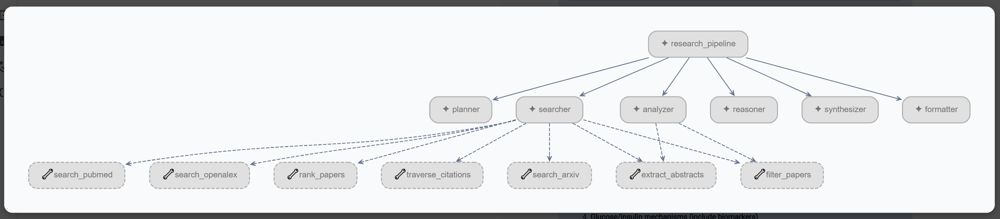

# Research Agent

A multi-agent research assistant built with [Google ADK](https://google.github.io/adk-docs/) that automatically searches academic databases, reasons about evidence quality, validates citations, and produces a structured literature review — given a single research question.



## What It Does

You type a research question. The pipeline does the rest:

1. **Clarifies** the query — refines vague questions into specific, searchable research queries
2. **Plans** targeted search strategies across databases
3. **Searches** ArXiv + PubMed + OpenAlex (with disk caching to avoid redundant API calls)
4. **Analyzes** themes and clusters findings
5. **Reasons** about evidence quality — grades papers, verifies claims against abstracts, detects gaps, and triggers automatic re-queries when coverage is insufficient
6. **Synthesizes** results into a structured review
7. **Validates** citations — cross-checks every PMID against PubMed to strip fabricated or misattributed references
8. **Formats** the output as a clean markdown report

---

## Architecture

### Procedural Orchestrator

The pipeline uses a **procedural orchestrator** ([orchestrator.py](research_agent/orchestrator.py)) instead of ADK's `SequentialAgent`. This enables:

- **Re-query loops** — if the Reasoner detects evidence gaps, the pipeline loops back through Search → Analyze → Reason up to 2 additional iterations with targeted gap-filling queries
- **Conditional logic** — decisions are made at the Python level rather than relying on agent handoffs
- **Langfuse tracing** — every agent invocation is wrapped with `@observe()` for full pipeline observability

### Agent Pipeline

| # | Agent | Model | Responsibility |
|---|---|---|---|
| 1 | **Clarifier** | `gemini-2.5-flash` | Refines the research question; asks follow-ups if needed |
| 2 | **Planner** | `gemini-2.5-flash` | Generates search strategies and database-specific queries |
| 3 | **Searcher** | `gemini-2.5-flash` | Executes searches across ArXiv, PubMed, OpenAlex; filters & ranks results |
| 4 | **Analyzer** | `gemini-2.5-flash` | Identifies themes, clusters findings, detects patterns |
| 5 | **Reasoner** | `gemini-2.5-flash` | Evidence grading, claim verification, gap analysis; triggers re-queries |
| 6 | **Synthesizer** | `gemini-2.5-flash` | Produces a structured literature review from verified evidence |
| 7 | **Validator** | `gemini-2.5-flash` | Cross-checks every PMID against PubMed; removes fabricated citations |
| 8 | **Formatter** | `gemini-2.5-flash` | Final markdown formatting and report polish |

### Tools

| Tool | Description |
|---|---|
| `search_arxiv` | Queries ArXiv via the `arxiv` Python library |
| `search_pubmed` | Queries PubMed via NCBI E-utilities (esearch + efetch) |
| `search_openalex` | Queries OpenAlex (250M+ works, no API key required) |
| `filter_papers` | Filters by year, citation count, keywords, open access |
| `rank_papers` | Sorts papers by citations, year, or title |
| `extract_abstracts` | Batches abstracts + metadata for downstream agents |
| `traverse_citations` | Forward/backward citation traversal via Semantic Scholar |
| `validate_citations` | Verifies PMIDs against PubMed; detects fabricated and mismatched citations |
| `hybrid_search` | BM25 + dense vector search (BGE + Qdrant) with RRF fusion |

### Resilience & Caching

- **Retry logic** — `@retry` decorator with exponential backoff + jitter for all external API calls
- **Circuit breakers** — per-service breakers (PubMed, OpenAlex, Semantic Scholar) that open after 5 failures and recover after 60s
- **Disk cache** — MD5-keyed JSON file cache under `.cache/` to avoid redundant API calls across runs

### Reasoning & Verification

The Reasoner agent outputs structured JSON ([`ReasonerOutput`](research_agent/models/reasoning.py)) with:

- **Evidence scores** — per-paper relevance, recency, and source quality (weighted composite → strong/moderate/weak)
- **Claim verification** — checks each claim against source abstracts; flags contradictions and unsupported claims
- **Gap analysis** — identifies under-covered themes and triggers automatic re-queries with new search terms
- **Self-critique** — LLM self-evaluation of its own grading

---

## Project Structure

```
adk-agent/
├── research_agent/
│   ├── __init__.py            # Logging setup (file + console, unique per run)
│   ├── orchestrator.py        # Procedural pipeline with re-query loops
│   ├── agents/
│   │   ├── clarifier.py       # Query refinement
│   │   ├── planner.py         # Search strategy generation
│   │   ├── searcher.py        # Multi-database search execution
│   │   ├── analyzer.py        # Theme identification & clustering
│   │   ├── reasoner.py        # Evidence grading & gap detection
│   │   ├── synthesizer.py     # Structured review composition
│   │   ├── validator.py       # Citation integrity verification
│   │   └── formatter.py       # Final markdown formatting
│   ├── tools/
│   │   ├── arxiv_search.py
│   │   ├── pubmed_search.py
│   │   ├── openalex_search.py
│   │   ├── paper_filter.py
│   │   ├── paper_ranker.py
│   │   ├── abstract_extractor.py
│   │   ├── citation_traversal.py
│   │   ├── citation_validator.py
│   │   ├── cache.py           # MD5-keyed disk cache for API responses
│   │   └── retrieval.py       # Hybrid search (BM25 + Qdrant dense vectors)
│   ├── models/
│   │   ├── paper.py           # Paper / Author / PaperCollection models
│   │   └── reasoning.py       # EvidenceScore, ClaimVerification, GapAnalysis, ReasonerOutput
│   └── retrylogic/
│       ├── retry.py           # @retry decorator with exponential backoff + jitter
│       ├── circuit_breaker.py # CircuitBreaker state machine
│       ├── breakers.py        # Pre-configured breaker instances (PubMed, OpenAlex, S2)
│       └── exceptions.py      # Custom exceptions
├── api/
│   ├── main.py                # FastAPI REST endpoint (POST /research)
│   └── schemas.py             # Request/Response Pydantic models
├── server.py                  # FastAPI + SSE streaming server (GET /api/research/stream)
├── frontend/                  # React + Vite + TailwindCSS frontend
│   ├── index.html
│   ├── server.ts              # Express dev server with Gemini proxy
│   ├── src/
│   └── package.json
├── data/                      # Pre-built indexes (BM25 + Qdrant)
├── tests/
│   ├── conftest.py
│   ├── test_arxiv.py
│   ├── test_openalex.py
│   ├── test_models.py
│   ├── test_tools.py
│   ├── test_retrylogic.py
│   └── test_server.py
├── pyproject.toml
└── README.md
```

---

## Setup

### Prerequisites

- Python 3.11+
- [uv](https://docs.astral.sh/uv/) (recommended) or pip
- Node.js 18+ (for the frontend)
- A **Google Cloud project** with Vertex AI enabled
- [Google Cloud CLI](https://cloud.google.com/sdk/docs/install) (`gcloud`)

### 1. Clone and install

```bash
git clone https://github.com/ameynarwadkar/adk-research-agent.git
cd adk-research-agent

# Python dependencies
uv sync

# Frontend dependencies
cd frontend && npm install && cd ..
```

### 2. Authenticate with Google Cloud

```bash
# One-time login (sets Application Default Credentials)
gcloud auth application-default login

# Set your project
gcloud config set project YOUR_PROJECT_ID
```

### 3. Configure environment

```bash
cp research_agent/.env.example research_agent/.env
```

Edit `research_agent/.env`:

```env
GOOGLE_GENAI_USE_VERTEXAI=TRUE
GOOGLE_CLOUD_PROJECT=your-gcp-project-id
GOOGLE_CLOUD_LOCATION=us-central1

# Optional: Langfuse tracing
# LANGFUSE_SECRET_KEY="sk-lf-..."
# LANGFUSE_PUBLIC_KEY="pk-lf-..."
# LANGFUSE_HOST="https://cloud.langfuse.com"

# Optional: OpenAlex polite pool (higher rate limits)
# OPENALEX_EMAIL=your@email.com
```

### 4. Run

**Option A — SSE streaming server (with frontend)**

```bash
# Start the backend (streams agent progress via SSE)
uv run uvicorn server:app --host 0.0.0.0 --port 8080 --reload

# In a separate terminal, start the frontend
cd frontend && npm run dev
```

**Option B — REST API only**

```bash
uv run uvicorn api.main:app --host 0.0.0.0 --port 8000 --reload
```

**Option C — ADK Web UI (legacy)**

```bash
adk web research_agent
```

---

## Test it yourself!

### Example Prompt

```
Does intermittent fasting improve metabolic health markers (blood glucose,
insulin sensitivity, BMI) in adults with type 2 diabetes compared to
continuous caloric restriction?

Population: Adults (18+) with type 2 diabetes
Geography: Global
Method: RCTs and systematic reviews preferred
Time range: 2015–2025
```

### Example output (truncated)

```markdown
# Literature Review: Does intermittent fasting improve metabolic health...

## Overview
This review synthesizes evidence from 3 systematic reviews/meta-analyses and
1 primary RCT identified across PubMed...

## Evidence by Outcome

### Blood Glucose / HbA1c
- **Finding**: IF/TRE generally improves glycaemic markers versus control,
  with effects strongest in the short term.
- **Strength**: Moderate–Strong
> "IF significantly decreased HbA1c ... in the short term compared to
>  control interventions." (PMID:40367729)

## Citation Audit
- Total checked: 8
- Verified: 6
- Removed (invalid): 1
- Removed (topic mismatch): 1

## Bottom Line
Evidence from multiple meta-analyses supports short-term glycaemic benefits
of intermittent fasting in adults with type 2 diabetes...
```

---

## Running Tests

```bash
uv run pytest
```

---

## Dependencies

| Package | Purpose |
|---|---|
| `google-adk >= 2.2.0` | Agent framework — LlmAgent, Runner, session management |
| `pydantic >= 2.0` | Data models (Paper, ReasonerOutput, API schemas) |
| `httpx >= 0.27` | Async HTTP client for PubMed, OpenAlex, Semantic Scholar |
| `arxiv >= 4.0.0` | ArXiv search library |
| `fastapi >= 0.115` | REST API + SSE streaming server |
| `uvicorn[standard] >= 0.30` | ASGI server |
| `langfuse >= 2.0` | Observability — tracing agent runs and tool calls |
