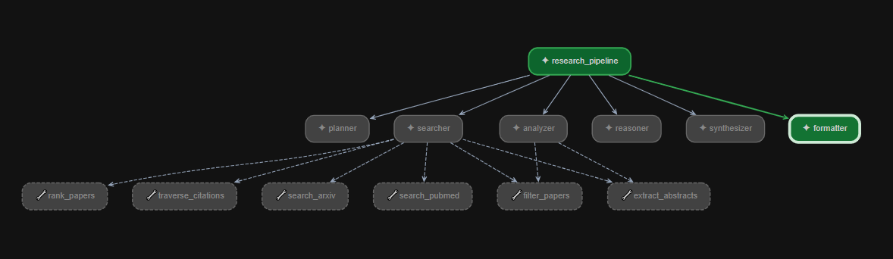

# Research Agent

A multi-agent research assistant built with [Google ADK](https://google.github.io/adk-docs/) that automatically searches academic databases, analyzes papers, assesses evidence quality, and produces a formatted literature review — given a single research question.

---

## What It Does

You type a research question. The pipeline does the rest:

1. Plans targeted search strategies
2. Searches ArXiv + PubMed + Semantic Scholar
3. Analyzes themes and clusters findings
4. Assesses evidence quality and detects gaps
5. Synthesizes results into a structured review
6. Formats the output as a clean markdown report

---

## Agent Pipeline

```
User Question
     │
     ▼
┌─────────────┐
│   Planner   │  Generates 3–5 search queries, year ranges, key terms,
│             │  fields of study, and a foundational-vs-recent priority plan.
│             │  ── output_key: search_guidance
└──────┬──────┘
       │
       ▼
┌─────────────┐
│   Searcher  │  Runs multiple queries across ArXiv and PubMed.
│             │  Filters, ranks, and extracts abstracts. Optionally
│             │  traverses the citation graph via Semantic Scholar.
│             │  ── output_key: search_results
└──────┬──────┘
       │
       ▼
┌─────────────┐
│   Analyzer  │  Performs thematic clustering on the retrieved papers.
│             │  Groups findings into 3–6 themes with evidence strength
│             │  ratings (strong / moderate / weak).
│             │  ── output_key: analysis_results
└──────┬──────┘
       │
       ▼
┌─────────────┐
│   Reasoner  │  Grades evidence quality, verifies claims against
│             │  abstracts, and identifies coverage gaps. Outputs
│             │  structured JSON with scores and re-query suggestions.
│             │  ── output_key: reasoning_output
└──────┬──────┘
       │
       ▼
┌─────────────┐
│ Synthesizer │  Produces a structured JSON literature review with
│             │  outcomes, evidence excerpts, trial summaries, and
│             │  a bottom-line answer.
│             │  ── output_key: final_review
└──────┬──────┘
       │
       ▼
┌─────────────┐
│  Formatter  │  Converts the JSON review into a readable markdown
│             │  prose report with citations, blockquotes, and sections.
│             │  ── output_key: formatted_report
└─────────────┘
```



### Tools available to agents

| Tool | Used by | Description |
|---|---|---|
| `search_arxiv` | Searcher | Queries ArXiv via the `arxiv` Python library |
| `search_pubmed` | Searcher | Queries PubMed via NCBI E-utilities (esearch + efetch) |
| `search_openalex` | Searcher | Queries OpenAlex (250M+ works, no API key required) |
| `filter_papers` | Searcher, Analyzer | Filters by year, citation count, keywords, open access |
| `rank_papers` | Searcher | Sorts papers by citations, year, or title |
| `extract_abstracts` | Searcher, Analyzer | Batches abstracts + metadata for downstream agents |
| `traverse_citations` | Searcher | Forward/backward citation traversal via Semantic Scholar |

---

## Project Structure

```
adk-agent/
├── research_agent/
│   ├── agent.py              # Root SequentialAgent — wires the pipeline
│   ├── agents/
│   │   ├── planner.py
│   │   ├── searcher.py
│   │   ├── analyzer.py
│   │   ├── reasoner.py
│   │   ├── synthesizer.py
│   │   └── formatter.py
│   ├── tools/
│   │   ├── arxiv_search.py
│   │   ├── pubmed_search.py
│   │   ├── paper_filter.py
│   │   ├── paper_ranker.py
│   │   ├── abstract_extractor.py
│   │   └── citation_traversal.py
│   ├── models/
│   │   └── paper.py          # Shared Paper / Author / PaperCollection models
│   └── retrylogic/
│       ├── retry.py          # Exponential backoff decorator + retry_async
│       ├── circuit_breaker.py
│       └── exceptions.py
├── pyproject.toml
└── README.md
```

---

## Setup

### Prerequisites

- Python 3.11+
- [uv](https://docs.astral.sh/uv/) (recommended) or pip
- An **Azure OpenAI** resource with a model deployment

### 1. Clone and install

```bash
git clone <repo-url>
cd adk-agent

# Create venv and install dependencies
uv sync

# Install LiteLLM (Azure OpenAI bridge)
uv pip install litellm
```

### 2. Configure environment

Create `research_agent/.env`:

```env
GOOGLE_GENAI_USE_VERTEXAI=FALSE
AZURE_API_KEY=<your Azure OpenAI key>
AZURE_API_BASE=https://<your-resource>.openai.azure.com/
AZURE_API_VERSION=2025-04-01-preview
AZURE_DEPLOYMENT_ID=<your deployment name, e.g. gpt-4o>
```

**Where to find these values in the Azure Portal:**

| Variable | Location |
|---|---|
| `AZURE_API_KEY` | Azure OpenAI resource → **Keys and Endpoints** → Key 1 |
| `AZURE_API_BASE` | Same page → **Endpoint** |
| `AZURE_API_VERSION` | Match the version shown in Azure AI Foundry |
| `AZURE_DEPLOYMENT_ID` | Azure AI Foundry → **Deployments** → your model name |

### 3. Run

```bash
adk web research_agent
```

Open [http://localhost:8000](http://localhost:8000) in your browser.

---

## Example Prompt

```
Does intermittent fasting improve metabolic health markers (blood glucose,
insulin sensitivity, BMI) in adults with type 2 diabetes compared to
continuous caloric restriction?

Population: Adults (18+) with type 2 diabetes
Geography: Global
Method: RCTs and systematic reviews preferred
Time range: 2015–2025
```

### Example output (truncated)

```markdown
# Literature Review: Does intermittent fasting improve metabolic health...

## Overview
This review synthesizes evidence from 3 systematic reviews/meta-analyses and
1 primary RCT identified across PubMed...

## Evidence by Outcome

### Blood Glucose / HbA1c
- **Finding**: IF/TRE generally improves glycaemic markers versus control,
  with effects strongest in the short term.
- **Strength**: Moderate–Strong
> "IF significantly decreased HbA1c ... in the short term compared to
>  control interventions." (PMID:40367729)

## Bottom Line
Evidence from multiple meta-analyses supports short-term glycaemic benefits
of intermittent fasting in adults with type 2 diabetes...
```

---

## Architecture Notes

- All agents share session state via ADK's built-in session mechanism. Each agent writes its output to a named key (`search_guidance`, `search_results`, etc.) which downstream agents read via `{variable}` template substitution in instructions.
- The `retrylogic` package provides an `@retry` decorator with exponential backoff + jitter and a `CircuitBreaker` context manager for protecting external API calls (ArXiv, PubMed, Semantic Scholar).
- The `Paper` Pydantic model is the shared data contract between all tools and agents — every tool returns `Paper.model_dump()` dicts for consistent serialisation.
- Azure OpenAI is connected via [LiteLLM](https://docs.litellm.ai/) using ADK's `LiteLlm` model wrapper, making the backend swappable (Ollama, OpenAI, Anthropic, etc.) by changing a single env var.

---

## Dependencies

| Package | Purpose |
|---|---|
| `google-adk >= 2.2.0` | Agent framework, SequentialAgent, LlmAgent, tools |
| `pydantic >= 2.0` | Data models (Paper, Author, PaperCollection) |
| `httpx >= 0.27` | HTTP client for PubMed + Semantic Scholar |
| `arxiv >= 4.0.0` | ArXiv search library |
| `litellm` | Azure OpenAI (and any other LLM provider) bridge |
